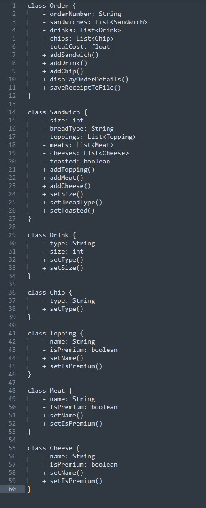

# The-Deli-cious Sandwich 


### What is the Deli-cious sandwich program?
>This is a Point of Sales (POS) application for DELI-cious, a custom sandwich shop. The application allows customers to place orders for sandwiches, drinks, and chips, and customize their sandwiches with various toppings. The program guides the customer through the ordering process, prompting them to select sandwich size, bread type, toppings, and any additional options such as toasting or extra toppings.

>Once the order is complete, the application displays the order details, including a list of sandwiches with toppings and the total cost of the order. The customer can then verify that the order is correct before completing the order. The order details are saved to a receipt file, named by the date and time the order was placed, in a receipts folder.


## Process
> Beginning stages: an idea on how I wanted my display to function/look like. However, it did change quite a bit as I coded




## Screenshots


## Code 
> `Signature Sandwich ` interface made it super easy to have prepopulated sandwiches that could be customized. 
```java
    
    public interface SignatureSandwich
{
    List<Toppings> getToppings();
    void addTopping(Toppings topping);
    void removeTopping(Toppings topping);
    String getName();

}

public class BLT extends Sandwich implements SignatureSandwich {
    public BLT(int size) {
        super("White", size,true);

        addTopping(new Toppings("Lettuce"));
        addTopping(new Toppings("Tomato"));
        addSauce(new Sauce("Ranch"));
        addMeat(new Meat(Meat.BACON));
        addCheese(new Cheese(Cheese.CHEDDAR));
        setToasted(true);
    }

    public void addMeat(Meat meat) {
        addTopping(meat);
    }

    public void addCheese(Cheese cheese) {
        addTopping(cheese);
    }

    @Override
    public List<Toppings> getToppings() {
        return super.getToppings();
    }

    @Override
    public void addTopping(Toppings topping) {
        super.addTopping(topping);
    }

    @Override
    public void removeTopping(Toppings topping) {
        super.removeTopping(topping);
    }

    @Override
    public String getName() {
        return "BLT";
    }
}

```


>**Interest Piece:** one piece of interest that I really enjoyed coding was price calculator function. It just helped with readablitly and differentiating from the the other classes as this strictly onlt deals with the prices and calculations. 
```java

    public static double calculateToppingPrice(int size, List<Toppings> toppings) {

        double total = getSandwichSizeCost(size);
        double additionalMeatCost = getAdditionalMeatCost(size);
        double additionalCheeseCost = getAdditionalCheeseCost(size);
        boolean isFirstMeat, isFirstCheese;

        isFirstMeat = true;
        isFirstCheese = true;

        for (Toppings topping : toppings) {
            if (topping instanceof Meat) {
                if (((Meat) topping).getType().equals(Meat.NO_MEAT)){
                    continue;
                }
                if (isFirstMeat) {
                    total += getMeatBaseCost(size) ;
                    isFirstMeat = false;

                } else {
                    total += additionalMeatCost;
                }
            } else if (topping instanceof Cheese) {
                if (((Cheese) topping).getType().equals(Cheese.NO_CHEESE)) {
                    continue;
                }
                if (isFirstCheese) {

                    total += getCheeseBaseCost(size) ;
                    isFirstCheese = false;

                } else {
                    total += additionalCheeseCost;
                }
            }
        }

        return total;
    }


    public static double getDrinkTotal(Order order){
        double drink = 0;
        for(Drinks d: order.getDrinks())
        {
            drink += d.getPrice();
        }
        return drink;
    }

    public static double getChipsTotal(Order order){
        double chips = 0;
        for(Chips c: order.getChips())
        {
            chips += c.getPrice();
        }
        return chips;
    }

    public static double getCheeseBaseCost(int size)
    {
        switch (size) {
            case 4 -> cheeseBasePrice = .75;
            case 8 -> cheeseBasePrice = 1.50;
            case 12 -> cheeseBasePrice = 2.25;
        }
        return cheeseBasePrice;
    }

    public static double getSandwichSizeCost(int size) {
        return switch (size) {
            case 4 -> 5.50;
            case 8 -> 7.00;
            case 12 -> 8.50;
            default -> 0;
        };
    }

    public static double getAdditionalMeatCost(int size) {
        return switch (size) {
            case 4 -> 0.50;
            case 8 -> 1.00;
            case 12 -> 1.50;
            default -> 0;
        };
    }

    public static double getAdditionalCheeseCost(int size) {
        return switch (size) {
            case 4 -> 0.30;
            case 8 -> 0.60;
            case 12 -> 0.90;
            default -> 0;
        };
    }

    public static double getMeatBaseCost(int size)
    {
        switch (size) {
            case 4:
                meatBasePrice = 1.00;
                break;
            case 8:
                meatBasePrice = 2.00;
                break;
            case 12:
                meatBasePrice = 3.00;
                break;
        }
        return meatBasePrice;
    }

    public static double getDrinkSizePrice(String drinkSize) {
        double drinkPrice = 0;

        if (drinkSize.equalsIgnoreCase("small") || drinkSize.equalsIgnoreCase("s")
                || drinkSize.equals("1")) {
            drinkPrice = 2.00;
        } else if (drinkSize.equalsIgnoreCase("medium") || drinkSize.equalsIgnoreCase("m")
                || drinkSize.equals("2")) {
            drinkPrice = 2.50;
        } else if (drinkSize.equalsIgnoreCase("large") || drinkSize.equalsIgnoreCase("l")
                || drinkSize.equals("3")) {
            drinkPrice = 3.00;
        } else {
            System.out.println("Invalid drink size. Please select a correct size");
            drinkPrice = 0;
        }
        return drinkPrice;
    }


```
